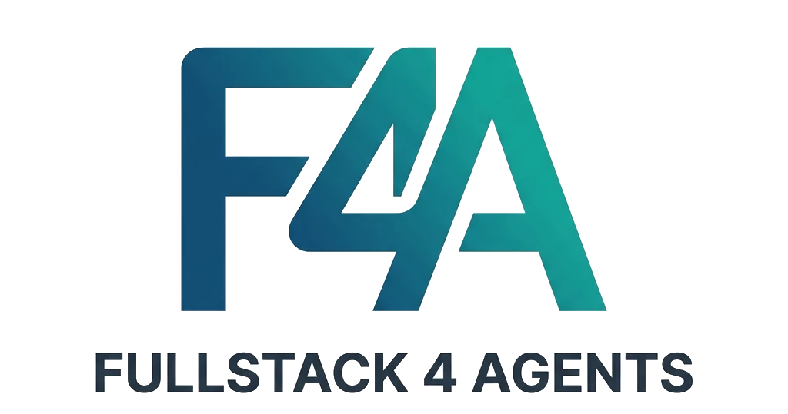

<p align="center">
  
</p>

A fullstack monorepo template designed for multi-agent development. Two AI agents can work in parallel — one on the frontend, one on the backend — coordinating through a shared file.

## Stack

**Frontend** — Nuxt 4, shadcn-vue, Tailwind CSS 4, Pinia, VeeValidate + Zod, @vueuse/motion, PocketBase JS SDK

**Backend** — Go, PocketBase (embedded), Gin

## Structure

```
├── frontend/          # Nuxt 4 app
├── backend/           # Go + PocketBase + Gin
├── skills/            # Copy-paste code templates for agents
├── docs/              # Frontend and backend guidelines
├── .coordination/     # Agent sync file (timestamped .md)
├── AGENTS.md          # Agent guide (read this first)
└── docker-compose.yml
```

## Ports

| Service          | Port |
| ---------------- | ---- |
| Frontend         | 3000 |
| Gin API          | 8313 |
| PocketBase admin | 8090 |

## Getting started

```bash
make install     # install frontend deps
make tidy        # tidy Go modules

make dev-frontend
make dev-backend
```

## Docker

```bash
make up    # build and start all services
make down  # stop
```

## For agents

Read `AGENTS.md` first. Check `.coordination/` for the latest sync file before starting work, and update it when you're done.

Skills in `skills/` are copy-paste templates — use them before writing from scratch.

## License

MIT
